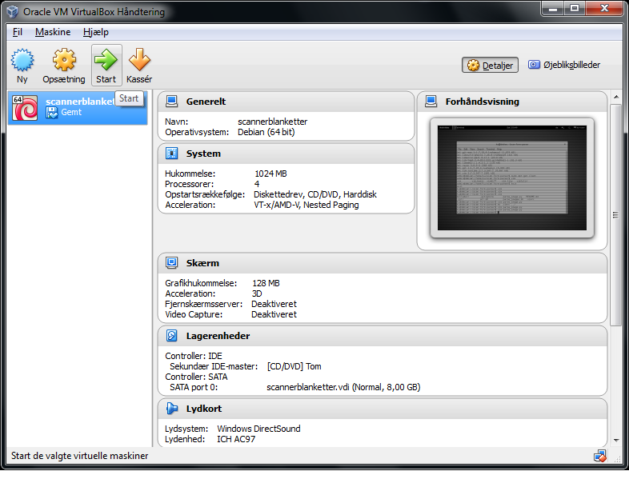
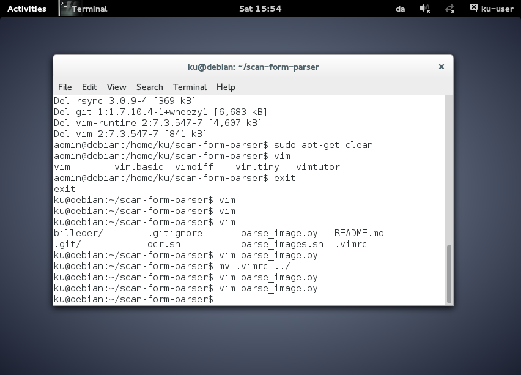
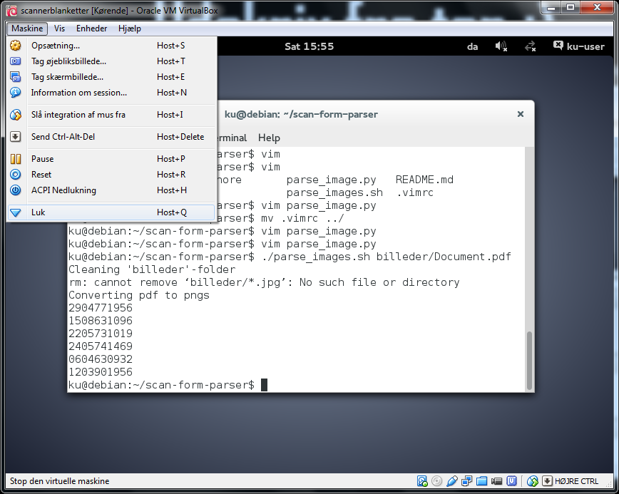
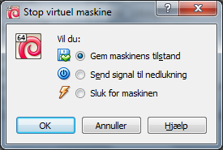

# Konvertér scannede scannerblanketter.

Denne guide beskriver hvorledes man kan bruge programmat `scan-form-parser` til
at konvertere scannerblanketter indskannet som en pdf, til jpg-filer navngivet
med CPR-nr. og skåret til 200x200 pixels. Programmaet køres gennem en linux
virtuel maskine, og guiden tager udgangspunkt i den debian vm som er
installeret på top-idkort-printer-pc'en i kælderen.

#### 1)
Start med at åben `Virtualbox` (der ligger en genvej på skrivebordet).



Tryk på start (grøn pil) for at starte linux VM'en.

#### 2)
Når VM'en er åbnet op skulle terminalen være åben og være i den rette mappe.
Hvis dette ikke er tilfældet så kan man åbne en ny terminal ved at trykke på
`windows-knappen` og skrive `terminal` efterfulgt af `Enter`. Når terminalen er
åben skriver man følgende (uden $) for at komme ind i den rette mappe (alle
kommandoer udføres ved at trykke `Enter`).

```sh
$ cd scan-form-parser
```



Nu er man i mappen hvorfra scriptet skal køres. Scriptet køres ved at indtaste
følgende:

```sh
$ ./parse_images.sh billeder/Document.pdf
```
Den første del er selve scriptet og den anden del er stien til pdf dokumentet.
Når scriptet er færdig med at køre så skulle billederne ligge i mappen
`scan-billeder` på windows skrivebordet. Hvis der undervejs er en
scannerblanket hvor CPR-nr'et er for udtydeligt til at programmet kan læse det
så vil der åbne et billede op med en kopi af CPR-nr'et og så skal man selv
indtaste det korrekt i terminalen.

####3)
Når man er færdi kan VM'en lukkes ved at gå op i menuen `Maskine` og vælge
`Luk` som vist nedenfor.



Vælg `Gem maskinens tilstand` således at den bare starter hvor man sluttede
næste gang den skal bruges.



De producerede billeder ligger i `scan-billeder` mappen på skrivebordet og kan
kopieres over i den rigtige `billeder`-mappe som normalt.

#

Hvis i finder nogle fejl i scriptet så send info om dem til mig på
`mikkel.larsen@adm.ku.dk`.
